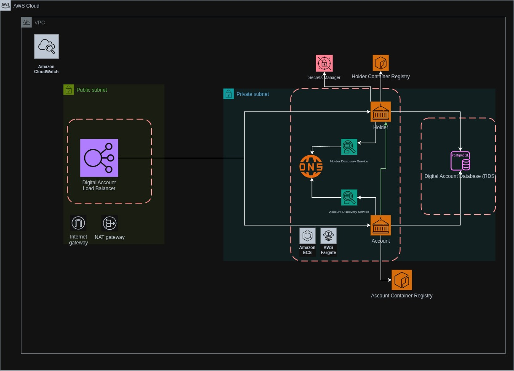

# Nome da Aplicação

## Sobre
Esta aplicação é um exemplo de aplicação distribuída com microsserviços para gerenciamento de contas bancárias digitais.
Ela foi implementada para o desafio da empresa [**Dock**](https://dock.tech/). Na implementação, são utilizados alguns conceitos de microsservicos, que são mais detalhados a seguir.

## Descrição da Arquitetura

### Desenho arquitetural do projeto

A seguir é apresentado um diagrama simplificado da arquitetura da aplicação:



Dentro da arquitetura, temos os elementos principais:

- **Load Balancer**: Serviço de balanceamento de carga, que recebe as requisições em um único ponto e as redireciona para os microsserviços:
- **Microsserviço de *holder* (Portador)**: Gerencia os portadores da conta digital, realizando cadastro, fornecendo dados,
    removendo (exclusão lógica) e listando os portadores ativos. Acaba utilizando os serviços do secrets manager, para obter o 
    salt utilizado para gerar o hash do documento do portador.
- **Microsserviço de *account* (Conta)**: Gerencia as contas bancárias digitais, realizando cadastro após o cadastro do portador,
    fornecendo dados, realizando saques, depositos e consulta de extrato (movimentações), permitindo bloqueio e desbloqueio das contas, 
    além do fechamento de conta por exclusão lógica e reabertura. Se comunica diretamente com o microsserviço de holder, para realizar consultas
    aos portadores para saber o estado de cada um (cadastro ativo ou inativo).
- **Banco de dados SQL (PostgreSQL)**: para armazenar os dados. Os serviços acessam a instancia do banco de dados RDS, mas cada serviço tem seu proprio banco de dados na infraestrutura.

Além desses serviços, temos a seguinte infraestrutura de apoio:


- **VPC**: Infraestrutura Virtual na Nuvem para a disponibilização de todos os recursos da aplicação.
- **Internet Gateway**: Disponibiliza a rede da VPC para a Internet.
- **DNS Privada**: Disponível para os microsserviços no ECS, para que seja possível a comunicação entre eles.
- **Service Discovery**: Disponibilizado aliados ao DNS Privado para os microsserviços no ECS, para que seja possível a comunicação entre eles,
mesmo que eles tenham IPs dinâmicos.
- **Secrets Manager**: Necessário para que o microsserviço **holder** possa obter o salt utilizado para gerar o hash do documento do portador
De forma que os documento do portador não seja exposto no banco de dados.
- **ECS Fargate**: Infraestrutura para execução dos microsserviços, provendo escalabilidade automática e alocação dinamica de endereço IP dentro das sub-redes privadas.
- **ECR**: Repositório para armazenamento e provisão das imagens docker das aplicações.
- **Amazon RDS**: Banco de dados para armazenar os dados das contas digitais.
- **Sub-redes privadas**: Sub redes alocadas para os microsserviços e o banco de dados. 
   Os serviços e recursos alocados nessas sub-redes só podem ser acessados dentro da VPC.
- **Sub-redes públicas**: Sub redes alocadas dentro da VPC para que a comunicação com a internet seja possível, é onde o load balancer está alocado.
- **Internet Gateway**: Disponibiliza a rede da VPC para a Internet.
- **NAT Gateway**: Permite que a rede privada acesse a rede pública, de forma que os microsserviços tenham uma conexão de saída para a internet.
- **Grupos de segurança**: Representado na imagem pelas linhas tracejadas, definem as regras de acesso a cada recurso, são três:
  - Grupo de segurança do Banco RDS
  - Grupo de segurança dos microsserviços
  - Grupo de segurança do Load Balancer
- **AWS IAM**: Necessário para estabelecer as politicas e papeis para todos os recursos.
- **Amazon CloudWatch**: Utilizado para o monitoramento de todos os microsserviços.

    
    
Além do que foi detalhado acima, as aplicações são atualizadas com Pipelines de CI/CD nas branches de deploy/account e deploy/holder.
Os trabalhos definidos no Github Actions compilam, executam os testes unitários, enviam as imagens para os repositórios ECR e 
acionam a entrega dos microsserviços na AWS.

### Detalhes da implementação

A aplicação foi desenvolvida com a linguagem de programação Java, versão 21, utilizando a framework Spring, principalmente o Spring Boot e o Spring Cloud.
Foi optado pela arquitetura de microsserviços, como forma de separar as responsabilidades das aplicações e permitir a escabalidade de forma efetiva.

Como padrão arquitetural do projeto, foi adotada a arquitetural hexagonal, pois mantém uma celeridade no desenvolvimento
e faz uma boa divisão entre a camada de domínio, que contem as regras de negócio; A camada de infraestrutura, que contém a comunicação com os recursos
(banco de dados, serviços externos, etc), e a camada de aplicação, que determina os casos de uso.

Os diretórios de cada microsserviço do projeto estão divididos em três partes principais:
- **application**: Contém os casos de uso da aplicação e faz a comunicação da API com a camada de domínio.
- **core**: É o núcleo da aplicação, contém todas a regras e rotinas de negócio. Se comunica com as outras camadas apenas por interfaces, chamadas de portas de entrada e portas de saída
, se mantendo agnóstica de framework.
- **infrastructure**: Realiza a comunicação com todos os recursos externos, tais como banco de dados, serviços http externos,
ferramentas em nuvem, framework para apresentação da API, etc.


Foi realizada uma concessão pequena na camada core, a permissão do uso de anotações de declaração de serviços e injeção de dependência do spring,
para que o desenvolvimento se tornasse menos complexo e mais celere.

A camada **core** foi validada fortemente com teste unitários, garantindo a qualidade do código e a 
confiabilidade do que foi desenvolvido.

A API da aplicação está no padrão REST nível 2, por se adequar mais ao contexto do negócio, permitir a descrição das 
funcionalidades de forma concisa (sem abertura a ambiguidades) e ter menor complexidade na implementação, dando celeridade ao desenvolvimento.

Toda a infraestrutura utilizada foi descrita seguindo o conceito IaC, utilizando o Terraform para provisionar os recursos em nuvem. 
Todo o código escrito para o provisionamento da infraestrutura foi feito em HCL (HashiCorp Configuration Language) e está no diretório 
**terraform** do repositório.

Descrição dos fluxos principais: 

- Abertura de conta:

    1. O registro do portador é criado no microsserviço **holder**, com o número de documento e nome do portador.
    2. É solicitada a abertura de conta no microsserviço **account**, com o número de documento do portador.
    3. A conta é aberta no banco de dados e seus dados (agencia, conta, saldo e limite diário) são apresentados.

- Saque:

    1. O saque é solicitado no microsserviço **account**, com o identificador da conta, valor do saque, 
    tipo de movimento (WITHDRAW) e descrição (opcional).
    2. O saque é efetuado se:
       1. O portador existe (ativo).
       2. A conta existe e não está bloqueada.
       3. O limite diário da conta não foi excedido.
       4. O saldo da conta é suficiente para realizar o saque.
    3. O saque é registrado no banco de dados e o saldo atualizado é informado.

- Depósito:

    1. O depósito é solicitado no microsserviço **account**, com o identificador da conta, valor do depósito, 
    tipo de movimento (DEPOSIT) e descrição (opcional).
    2. O depósito é efetuado se:
       1. O portador existe (ativo).
       2. A conta existe e não está bloqueada.
    3. O depósito é registrado no banco de dados e o saldo atualizado é informado.

- Extrato:

    1. O extrato é solicitado no microsserviço **account** (disponibilizado na API movement), com o identificador da conta, periodo dos movimentos e dados de paginação.
    2. O extrato é apresentado com as informações dos movimentos realizados na conta (em formato JSON).

- Bloqueio/Desbloqueio de Conta:

    1. O Bloqueio/Desbloqueio de conta é solicitado no microsserviço **account**, com o identificador da conta.
    2. O bloqueio/Desbloqueio da conta é efetuado se:
       1. A conta existe.
    3. A aplicação responde os dados da conta e o status de bloqueio/desbloqueio.

- Fechamento de Conta:

    1. O fechamento de conta é solicitado no microsserviço **account**, com o identificador da conta. 
    2. O portador da conta é removido do microsserviço **holder** por exclusão lógica.
    3. A conta é removida por exclusão lógica do banco de dados, com a atualização do status para "CLOSED".

- Reabertura de Conta:

    1. A reabertura de conta é solicitada no microsserviço **account**, se solicitada uma abertura de conta.
    2. A conta é reaberta no banco de dados, somente se:
       1. O portador de conta está ativo.
    3. A conta reaberta é apresentada.
    4. OBS.: É possível solicitar a reativação do portador pelo microsserviço **holder**.
  
## Construção e Execução Local

Pré-requisitos:
- Docker
- Git

Passos:
1. Clone o repositório:
   ```bash
   git clone <url-do-repositório>.git
   ```
2. Entre no diretório do projeto:
   ```bash
   cd <nome-do-repositório>/local
   ```
3. Execute os containers da aplicação (microsserviços, banco de dados PostgreSQL e Localstack):
   ```bash
   docker compose up -d
   ```
4. Acesse as APIs no navegador:
    - Microsserviço **holder**:  
      http://localhost:8081/holder/swagger-ui.html
    - Microsserviço **account**:  
      http://localhost:8082/account/swagger-ui.html

## Acesso na Internet

Para acessar as rotas da aplicação na internet, utilize as URLs abaixo:

- Microsserviço **holder**:  
  http://digital-account-load-balancer-900831026.us-east-2.elb.amazonaws.com/holder/swagger-ui.html
- Microsserviço **account**:  
  http://digital-account-load-balancer-900831026.us-east-2.elb.amazonaws.com/account/swagger-ui.html

## Possíveis Melhorias
- Implementar autenticação para acesso a API
- Utilizar o API Gateway no lugar do load balancer para centralizar as requisições
- Adicionar testes de integração
- Adicionar um cache para o microsserviço **holder**
- Criar um terceiro microsserviço para implementar o padrão CQRS para consulta de movimentações em caso de alta demanda
  - Recebendo replicas das movimentações em tempo real através do Amazon SQS
  - Adicionando as movimentações em um banco de dados NoSQL (ex: DynamoDB)